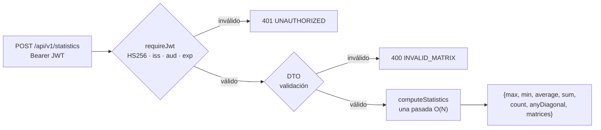

# api-node · Estadísticas de matrices

API REST en **Node.js 22 + Express 5** que recibe matrices y calcula, en **una sola pasada**, el **valor máximo,
mínimo, promedio, suma total** y si **alguna matriz es diagonal**. En el flujo principal la consume
**api-go** (repositorio propio) con las matrices Q y R de la factorización QR, y el frontend también la llama directamente.

Es un **servicio autónomo**: se construye, prueba y despliega por separado, y no conoce a sus clientes
([ADR-001](docs/architecture/ADR-001-servicios-independientes.md), [ADR-002](docs/architecture/ADR-002-decisiones-tecnicas.md)).

## Contenido
- [Cómo funciona](#cómo-funciona)
- [Requisitos](#requisitos)
- [Inicio rápido](#inicio-rápido)
- [Uso de la API](#uso-de-la-api)
- [Configuración](#configuración)
- [Arquitectura y estructura](#arquitectura-y-estructura)
- [Health check](#health-check)
- [Pruebas: cómo lanzarlas](#pruebas-cómo-lanzarlas)
- [SDD: especificaciones](#sdd-especificaciones)
- [Docker](#docker)
- [Despliegue en AWS](#despliegue-en-aws)
- [Integración continua](#integración-continua)
- [Problemas frecuentes](#problemas-frecuentes)
- [Reglas de contribución](#reglas-de-contribución)

---

## Cómo funciona



- **Una sola pasada:** máximo, mínimo, suma, conteo y diagonalidad se calculan recorriendo cada valor una vez;
  el promedio es suma / conteo.
- **Matriz diagonal:** todos los elementos con i ≠ j son 0, con tolerancia `DIAGONAL_TOLERANCE` (1e-10) para absorber
  el error de coma flotante de la QR. Se acepta la definición rectangular (m×n), porque R es m×n.
- **JWT:** valida el token emitido por api-go con el mismo secreto, emisor y audiencia, con algoritmo fijo HS256.

## Requisitos
- **Node.js 22+** para ejecutar localmente, o solo **Docker**.
- Un JWT emitido por api-go (o firmado con el mismo `JWT_SECRET`, `JWT_ISSUER` y `JWT_AUDIENCE`).

## Inicio rápido

```bash
cp .env.example .env          # define JWT_SECRET (el MISMO que en api-go)
```

| Opción | Comando |
|---|---|
| **Docker** (recomendada) | `docker compose up --build` |
| **Local** | `npm install && npm run dev` (recarga automática; `npm start` para modo normal). Ambos cargan `.env`. |

| URL | Qué es |
|---|---|
| http://localhost:3000/health | Estado del servicio |
| http://localhost:3000/docs | Referencia interactiva (Scalar) |
| http://localhost:3000/openapi.yaml | Contrato OpenAPI 3.1 ([`openapi/openapi.yaml`](openapi/openapi.yaml)) |

## Uso de la API

| Método | Ruta | Auth | Descripción |
|---|---|---|---|
| GET | `/health` | — | Estado del servicio |
| GET | `/docs` · `/openapi.yaml` | — | Documentación |
| POST | `/api/v1/statistics` | JWT | Estadísticas de 1 a `MAX_MATRICES` matrices |

El token se obtiene en api-go (`POST http://localhost:8080/api/v1/auth/login`):
```bash
curl -s -X POST http://localhost:3000/api/v1/statistics \
  -H "Authorization: Bearer $TOKEN" -H 'Content-Type: application/json' \
  -d '{"matrices":[{"name":"Q","values":[[1,0],[0,1]]},{"name":"R","values":[[2,3],[0,4]]}]}'
```
```json
{
  "max": 4, "min": 0, "average": 1.375, "sum": 11, "count": 8,
  "anyDiagonal": true,
  "matrices": [{ "name": "Q", "isDiagonal": true }, { "name": "R", "isDiagonal": false }]
}
```
`name` es opcional (por defecto `M1`, `M2`, ...).

### Errores
Todas las respuestas de error usan `{"error": {"code": "...", "message": "..."}}`.

| HTTP | `code` | Cuándo |
|---|---|---|
| 400 | `INVALID_REQUEST` | JSON mal formado |
| 400 | `INVALID_MATRIX` | Matrices ausentes, vacías, no rectangulares, no finitas o fuera de los límites |
| 401 | `UNAUTHORIZED` | Token ausente, inválido, expirado, de otro emisor o audiencia, o con otro algoritmo |
| 404 | `NOT_FOUND` | Ruta inexistente |
| 413 | `PAYLOAD_TOO_LARGE` | Cuerpo mayor que `BODY_LIMIT` |

## Configuración

| Variable | Default | Descripción |
|---|---|---|
| `PORT` | 3000 | Puerto HTTP |
| `JWT_SECRET` | — **obligatoria** (≥ 32) | Secreto HS256, igual al de api-go |
| `JWT_ISSUER` | api-go | Claim `iss` esperado |
| `JWT_AUDIENCE` | matrix-services | Claim `aud` esperado |
| `CORS_ALLOWED_ORIGINS` | http://localhost:4200 | Orígenes permitidos (frontend), separados por coma |
| `DIAGONAL_TOLERANCE` | 1e-10 | Valor absoluto bajo el cual un número cuenta como 0 |
| `MATRIX_MAX_DIMENSION` | 100 | Máximo de filas y columnas por matriz |
| `MAX_MATRICES` | 10 | Máximo de matrices por petición |
| `BODY_LIMIT` | 1mb | Tamaño máximo del cuerpo JSON |
| `LOG_LEVEL` | info (silent en pruebas) | Nivel de log (JSON estructurado con pino; el token se redacta) |

Si la configuración es inválida, el servicio **no arranca** y lista todos los problemas.

## Arquitectura y estructura

Clean Architecture con fábricas e inyección de dependencias (sin singletons):

```
api-node/
├── src/
│   ├── server.js            Punto de entrada: loadConfig, listen y apagado ordenado
│   ├── app.js               Raíz de composición: createApp(config), middlewares y rutas
│   ├── config/              loadConfig(env): valores por defecto y validación
│   ├── domain/              computeStatistics (matemática pura, O(N))
│   ├── dtos/                Validación de entrada y forma de la salida
│   ├── services/            createStatisticsService(config)
│   ├── controllers/         createStatisticsController(service)
│   ├── routes/              Rutas de estadísticas y de documentación
│   ├── middlewares/         requireJwt, errorHandler + notFound, requestLogger (pino-http)
│   └── errors/              AppError(statusCode, code, message)
├── openapi/                 openapi.yaml + docs.html (Scalar)
├── tests/                   unit/ · integration/ · helpers/
├── deploy/aws/              service.yml, platform.yml y scripts de despliegue (deploy, outputs, destroy)
├── specs/                   Especificaciones SDD por funcionalidad (Spec Kit)
├── .specify/                Constitución y plantillas de Spec Kit
├── docs/                    ADRs y guía de despliegue en AWS
├── .github/workflows/       CI (pruebas + build, sin despliegues)
├── Dockerfile               Multi-stage, solo dependencias de producción, usuario node, HEALTHCHECK
└── docker-compose.yml       Ejecución aislada
```

| Patrón | Dónde |
|---|---|
| Service Layer | `src/services`: casos de uso sin `req`/`res` |
| Dominio puro | `src/domain` |
| DTOs | `src/dtos` |
| Middleware | `requestLogger` → CORS → docs → `helmet` → `express.json` → `requireJwt` → `errorHandler` |

## Health check
| Nivel | Qué verifica | Dónde |
|---|---|---|
| Endpoint | `GET /health` → `{"status":"ok","service":"api-node"}` (público, sin JWT) | `src/app.js` |
| Docker | `HEALTHCHECK` con `wget` a `/health` cada 30 s (`docker ps` muestra *healthy*) | `Dockerfile` |
| AWS | Health check del contenedor + target group del ALB contra `/health`; rollback si falla | `deploy/aws/service.yml` |
| Clientes | api-go responde 502/504 si api-node no está sano; matrix-web muestra su estado | — |

## Pruebas: cómo lanzarlas
| Qué quieres | Comando |
|---|---|
| Todas las pruebas | `npm test` |
| Solo unitarias | `npm run test:unit` |
| Solo integración (supertest) | `npm run test:integration` |
| Un archivo o un nombre de prueba | `npx jest tests/unit/matrixStatistics.test.js` · `npx jest -t "diagonalidad"` |
| Modo watch | `npx jest --watch` |
| Cobertura (~99 %; reporte en `coverage/`) | `npm test -- --coverage` |

## SDD: especificaciones
Esta primera versión se desarrolló con **Spec-Driven Development** usando [Spec Kit](https://github.com/github/spec-kit):
primero la especificación, luego el plan, las tareas y la implementación guiada por pruebas.

- **Constitución** (principios que todo plan debe cumplir): [`.specify/memory/constitution.md`](.specify/memory/constitution.md)
- **Especificaciones** (una carpeta por funcionalidad, cada una con `spec.md`, `plan.md`, `research.md`,
  `data-model.md`, `contracts/`, `quickstart.md`, `tasks.md` y `checklists/`):

| Spec | Funcionalidad | Historias |
|---|---|---|
| [`001-estadisticas-matrices`](specs/001-estadisticas-matrices/spec.md) | Estadísticas en una pasada, detección de matriz diagonal, JWT y validación | 3 (P1, P1, P1) |

Flujo para una funcionalidad nueva (desde Claude Code en este repositorio):
`/speckit-specify` → `/speckit-clarify` → `/speckit-plan` → `/speckit-tasks` → `/speckit-implement`.

## Docker
- **Imagen:** multi-stage sobre `node:22-alpine`; instala solo dependencias de producción, corre como usuario
  `node` e incluye `HEALTHCHECK` contra `/health`.
- `docker compose up --build` levanta el servicio solo; lee `.env` y publica `${PORT:-3000}`.

## Despliegue en AWS
Se despliega en **ECS Fargate** detrás del ALB compartido, en el puerto **3000**
([guía completa](docs/deploy/aws.md), [ADR-004](docs/architecture/ADR-004-despliegue-aws.md)).
Despliégalo **antes que api-go**, porque api-go lo consume.

```bash
# Crea la plataforma compartida (red, ALB, clúster, secretos) si aún no existe; luego despliega este servicio
./deploy/aws/deploy.sh
./deploy/aws/outputs.sh                                       # URLs y contraseña de demo
PARAM_OVERRIDES="DesiredCount=2 LogLevel=debug" ./deploy/aws/deploy.sh   # con parámetros
```
En AWS, `JWT_SECRET` viene de **Secrets Manager** (el mismo que usa api-go) y `CORS_ALLOWED_ORIGINS` se calcula a
partir del ALB. Parámetros de [`deploy/aws/service.yml`](deploy/aws/service.yml): `Cpu`, `Memory`, `DesiredCount` y `LogLevel`.

**¿Usas ECS Express Mode desde la consola?** Sigue [docs/deploy/aws-express.md](docs/deploy/aws-express.md): puerto del contenedor, ruta del health check y variables de cada servicio.

**Costo y limpieza.** Los tres servicios comparten un solo balanceador y usan Fargate Spot: ≈ US$ 45 al mes si quedan
encendidos 24/7 y centavos para una demo de horas ([detalle](docs/deploy/aws.md#4-costos-estimados)). Pausar:
`PARAM_OVERRIDES="DesiredCount=0" ./deploy/aws/deploy.sh`. Eliminar: `CONFIRM=si ./deploy/aws/destroy.sh` (agrega
`DESTROY_PLATFORM=si` en el último servicio para borrar también la plataforma).

## Integración continua
[`.github/workflows/ci.yml`](.github/workflows/ci.yml): un solo job que corre `npm ci` → pruebas unitarias → integración → build de la imagen Docker (sin publicarla).
Pensado para costo mínimo: ignora cambios solo de documentación, cancela ejecuciones repetidas de la misma rama y
**no despliega ni usa servicios de AWS** (el despliegue es manual con `./deploy/aws/deploy.sh`).

## Problemas frecuentes
| Síntoma | Causa y solución |
|---|---|
| `Configuración inválida: JWT_SECRET es obligatorio...` | Falta `.env` o el secreto tiene menos de 32 caracteres |
| `401 UNAUTHORIZED` con un token de api-go | `JWT_SECRET`, `JWT_ISSUER` o `JWT_AUDIENCE` no coinciden entre servicios, o el token expiró |
| `413 PAYLOAD_TOO_LARGE` | Aumenta `BODY_LIMIT` o reduce la matriz |
| El navegador bloquea por CORS | Agrega el origen del frontend a `CORS_ALLOWED_ORIGINS` |

## Reglas de contribución
Todo cambio debe incluir, en el mismo commit o PR:
1. **Pruebas** unitarias nuevas o actualizadas (e integración si cambia un endpoint).
2. **Documentación** al día: JSDoc, este README, `.claude/CLAUDE.md` y `openapi/openapi.yaml` si cambia la API.
3. **Docker y despliegue** actualizados si cambian dependencias, variables de entorno, puertos o el build
   (`Dockerfile`, `docker-compose.yml`, `.env.example`, `.dockerignore` y `deploy/aws/service.yml`).
